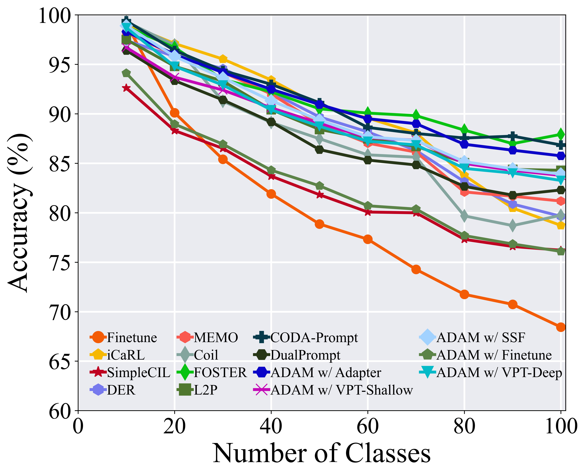
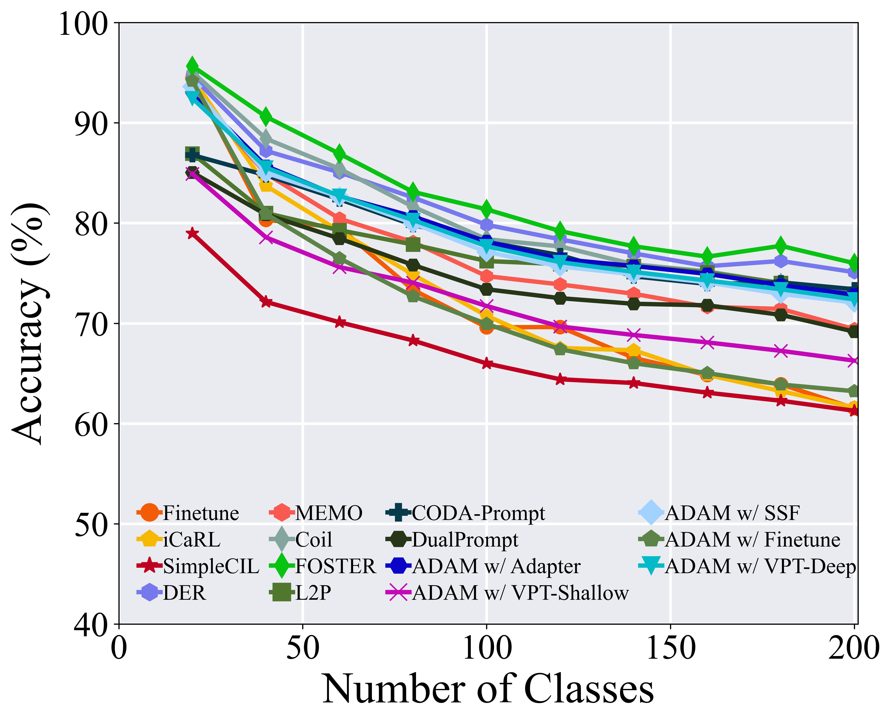

## 🌟 Methods Reproduced

- `FineTune`: Baseline method which simply updates parameters on new tasks.
- `iCaRL`: iCaRL: Incremental Classifier and Representation Learning. CVPR 2017 [[paper](https://arxiv.org/abs/1611.07725)]
- `Coil`: Co-Transport for Class-Incremental Learning. ACMMM 2021 [[paper](https://arxiv.org/abs/2107.12654)]
- `DER`: DER: Dynamically Expandable Representation for Class Incremental Learning. CVPR 2021 [[paper](https://arxiv.org/abs/2103.16788)]
- `FOSTER`: Feature Boosting and Compression for Class-incremental Learning. ECCV 2022 [[paper](https://arxiv.org/abs/2204.04662)]
- `MEMO`: A Model or 603 Exemplars: Towards Memory-Efficient Class-Incremental Learning. ICLR 2023 Spotlight [[paper](https://openreview.net/forum?id=S07feAlQHgM)]
- `SimpleCIL`: Revisiting Class-Incremental Learning with Pre-Trained Models: Generalizability and Adaptivity are All You Need. arXiv 2023 [[paper](https://arxiv.org/abs/2303.07338)]
- `L2P`: Learning to Prompt for Continual Learning. CVPR 2022 [[paper](https://arxiv.org/abs/2112.08654)]
- `DualPrompt`: DualPrompt: Complementary Prompting for Rehearsal-free Continual Learning. ECCV 2022 [[paper](https://arxiv.org/abs/2204.04799)]
- `CODA-Prompt`: CODA-Prompt: COntinual Decomposed Attention-based Prompting for Rehearsal-Free Continual Learning. CVPR 2023 [[paper](https://arxiv.org/abs/2211.13218)]
- `ADAM`: Revisiting Class-Incremental Learning with Pre-Trained Models: Generalizability and Adaptivity are All You Need. arXiv 2023 [[paper](https://arxiv.org/abs/2303.07338)]
- `RanPAC`: RanPAC: Random Projections and Pre-trained Models for Continual Learning. NeurIPS 2023 [[paper](https://arxiv.org/abs/2307.02251)]
- `LAE`: A Unified Continual Learning Framework with General Parameter-Efficient Tuning. ICCV 2023 [[paper](https://arxiv.org/abs/2303.10070)]
- `SLCA`: SLCA: Slow Learner with Classifier Alignment for Continual Learning on a Pre-trained Model. ICCV 2023 [[paper](https://arxiv.org/abs/2303.05118)]
- `Ease`: Expandable Subspace Ensemble for Pre-Trained Model-Based Class-Incremental Learning. CVPR 2024 [[paper](https://arxiv.org/abs/2403.12030)]
- `DGR`: Gradient Reweighting: Towards Imbalanced Class-Incremental Learning. CVPR 2024 [[paper](https://openaccess.thecvf.com/content/CVPR2024/papers/He_Gradient_Reweighting_Towards_Imbalanced_Class-Incremental_Learning_CVPR_2024_paper.pdf)]


## 📝 Reproduced Results

#### CIFAR-100

<div align="center">

</div>

#### ImageNet-R

<div align="center">

</div>

### 🗂️ Dependencies

1. [torch 2.0.1](https://github.com/pytorch/pytorch)
2. [torchvision 0.15.2](https://github.com/pytorch/vision)
3. [timm 0.6.12](https://github.com/huggingface/pytorch-image-models)
4. [tqdm](https://github.com/tqdm/tqdm)
5. [numpy](https://github.com/numpy/numpy)
6. [scipy](https://github.com/scipy/scipy)

### 🔑 Run experiment

1. Edit the `[MODEL NAME].json` file for global settings and hyperparameters.
2. Run:

    ```bash
    python main.py --config=./exps/[MODEL NAME].json
    ```

3. `hyper-parameters`

    When using PILOT, you can edit the global parameters and algorithm-specific hyper-parameter in the corresponding json file.

    These parameters include:

   - **model_name**: The model's name should be selected from the 12 methods listed above, *i.e.*, `finetune`, `icarl`, `coil`, `der`, `dgr`, `foster`, `memo`, `simplecil`, `l2p`, `dualprompt`, `coda-prompt` and `adam`.
   - **init_cls**: The number of classes in the initial incremental stage. As the configuration of CIL includes different settings with varying class numbers at the outset, our framework accommodates diverse options for defining the initial stage.
   - **increment**: The number of classes in each incremental stage $i$, $i$ > 1. By default, the number of classes is equal across all incremental stages.
   - **backbone_type**: The backbone network of the incremental model. It can be selected from a variety of pre-trained models available in the Timm library, such as **ViT-B/16-IN1K** and **ViT-B/16-IN21K**. Both are pre-trained on ImageNet21K, while the former is additionally fine-tuned on ImageNet1K.
   - **seed**: The random seed is utilized for shuffling the class order. It is set to 1993 by default, following the benchmark setting iCaRL.
   - **fixed_memory**: a Boolean parameter. When set to true, the model will maintain a fixed amount of memory per class. Alternatively, when set to false, the model will preserve dynamic memory allocation per class.
   - **memory_size**: The total number of exemplars in the incremental learning process. If `fixed_memory` is set to false, assuming there are $K$ classes at the current stage, the model will preserve $\left[\frac{{memory-size}}{K}\right]$ exemplars for each class. **L2P, DualPrompt, SimpleCIL, ADAM, and CODA-Prompt do not require exemplars.** Therefore, parameters related to the exemplar are not utilized.
   - **memory_per_class**: If `fixed memory` is set to true, the model will preserve a fixed number of `memory_per_class` exemplars for each class.

